# Dropbox-React-Kafka-Nodejs
A Dropbox like application using React.js | Node.js | Expres.js | MongoDb ( MERN Stack) + Apache Kafka

## Goal
* The goal is to build a distributed enterprise web application which enables the users to upload and delete files/folders and share files/folders to other users, create groups, add/delete members.
* The project was developed as Full Stack Web app using technologies such as React.js | Node.js | Expres.js | MongoDb ( MERN Stack) and Apache Kafka for stream-processing.

## System Design

### Architecture

The Web application includes kafka topics responsible to perform different activities. There are different consumers for each topic so that no one consumer gets overloaded with large number of requests on multiple topics. 

The system architecture is divided into 3 parts:
  *	kafka-back-end
  *	kafka-front-end
  *	reactlogin
  
The kafka-front-end produces messages and on response from kafka-back-end forward it to react client.

### Technology stack

<table>
<thead>
<tr>
<th>Area</th>
<th>Technology</th>
</tr>
</thead>
<tbody>
	<tr>
		<td>Front-End</td>
		<td>React, Redux, React Router, Bootstrap, HTML5, CSS3, Javascript ( ES6 )</td>
	</tr>
  	<tr>
		<td>Back-End</td>
		<td>Node.js, Express.js</td>
	</tr>
	<tr>
		<td>Authentication Middleware</td>
		<td>Passport.js</td>
	</tr>
	<tr>
		<td>Message oriented middleware</td>
		<td>Apache Kafka</td>
	</tr
	<tr>
		<td>API Testing</td>
		<td>Mocha, Postman</td>
	</tr>
  <tr>
		<td>Database</td>
		<td>MongoDB</td>
	</tr>
	<tr>
		<td>Performance Testing</td>
		<td>JMeter</td>
	</tr>
</tbody>
</table>

## Screenshots

##### HomePage/Login

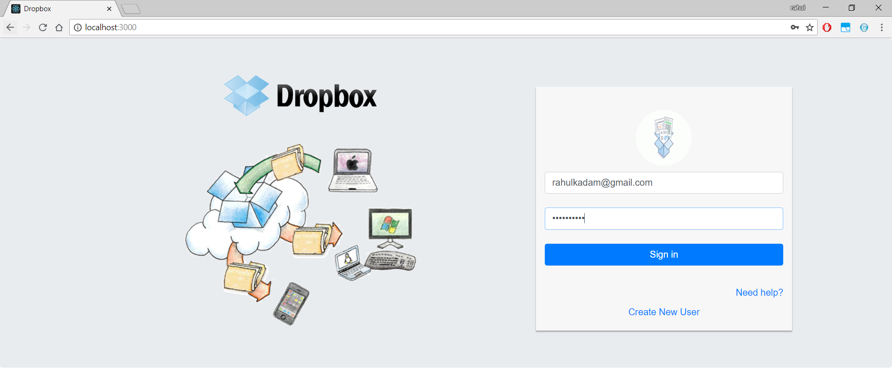

##### Register

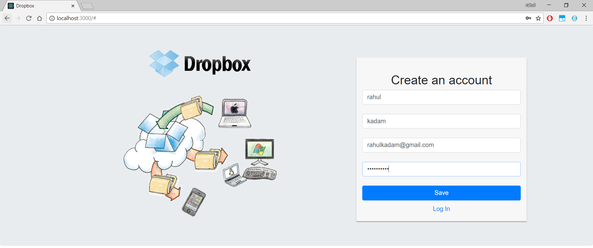

##### User Dashboard

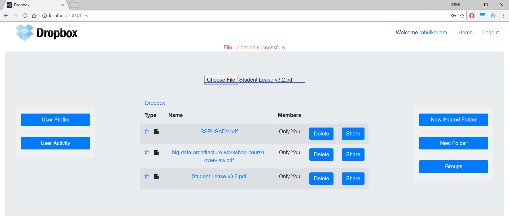

##### User Details

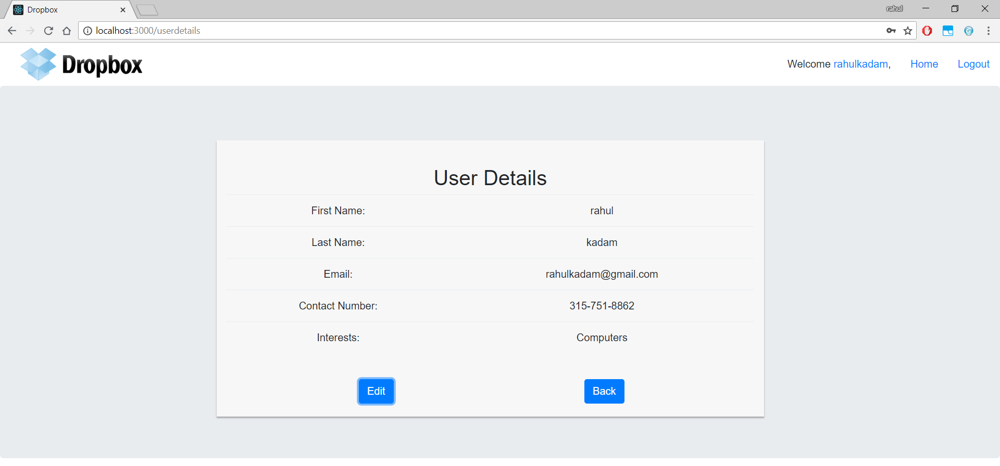

##### User Logs/Group Logs

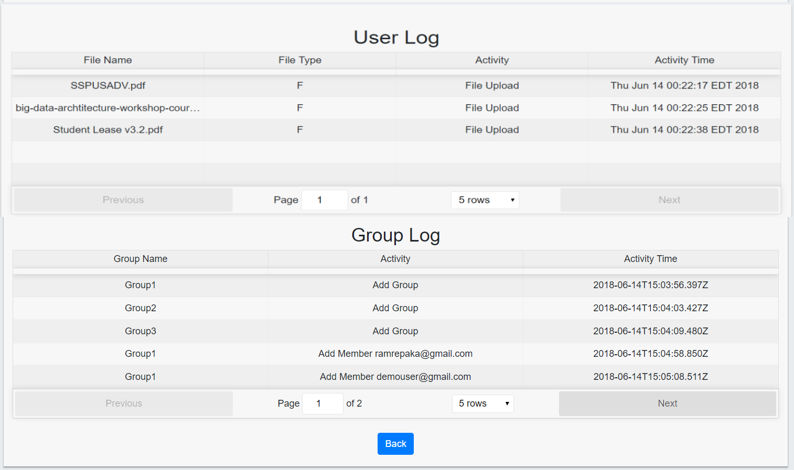

##### Delete Files

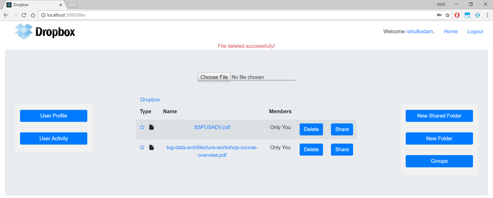

##### Create New Folder

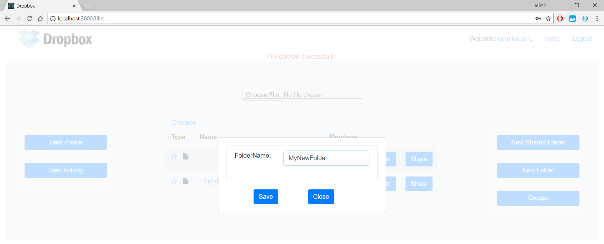
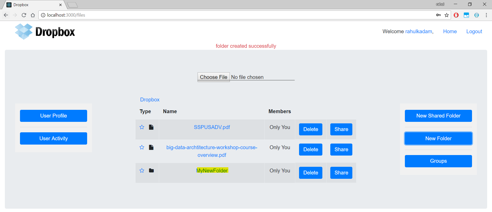

##### Share Files

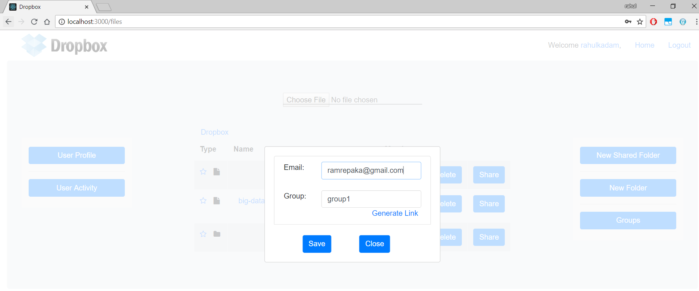
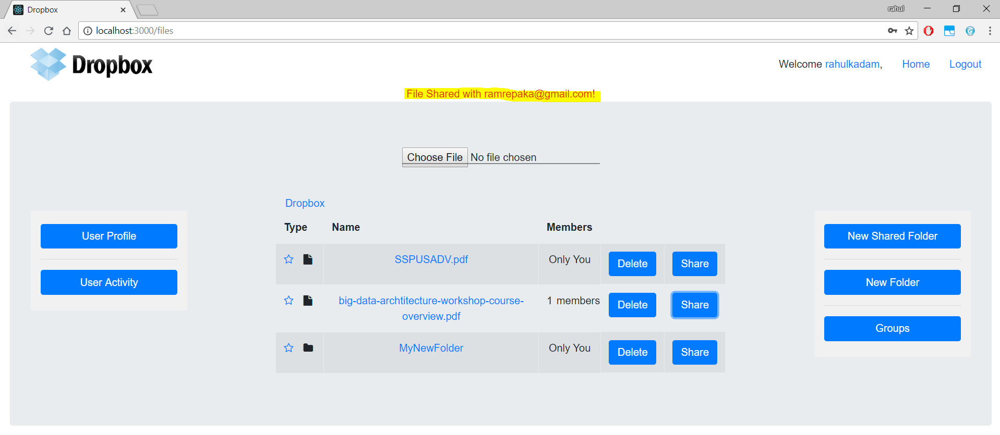
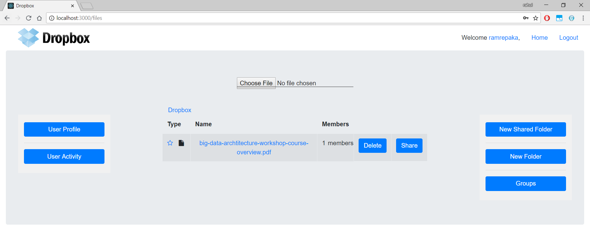

##### Groups & Members

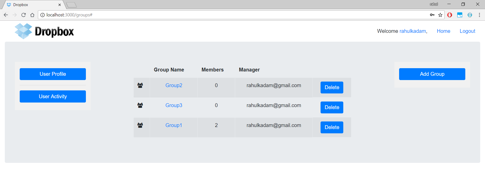
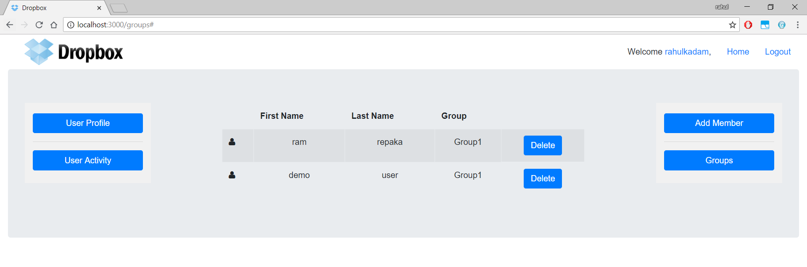
